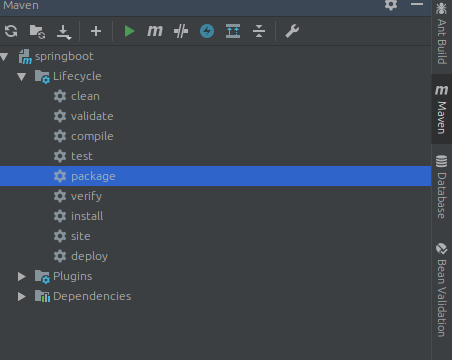
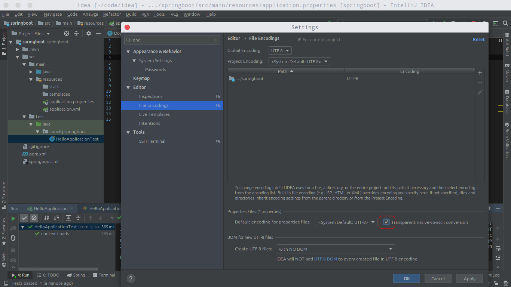
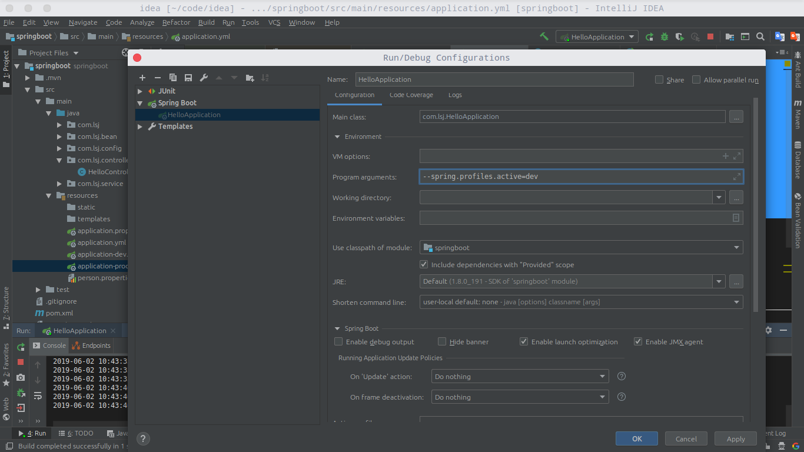
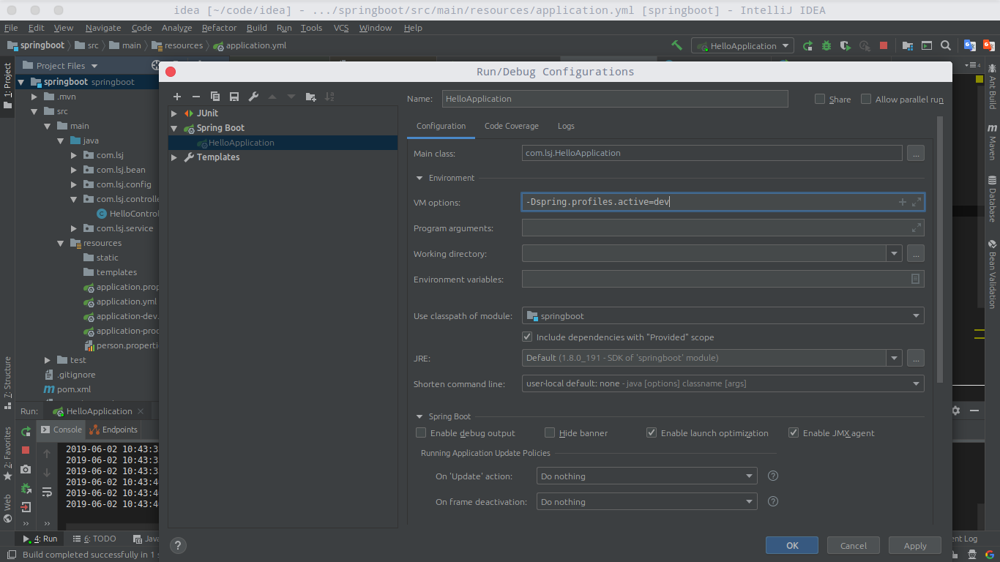

#  一、SpringBoot入门

## 1.SpringBoot简介

> 简化Spring应用开发的一个框架;
>
> 整个Spring技术栈的一个整合;
>
> J2EE开发的一站式解决方案

## 2.微服务

2014,martin fowler

微服务：架构风格(服务微化)

一个应用应该是一组小型服务;可以通过http的方式进行互通;

每一个功能元素最终都是一个可独立替换和独立升级的软件单元


环境约束

- jdk: SpringBoot 1.7及以上

- maven3.x: maven3.3以上版本
- idea2017
- springboot1.5.9 RELEASE

## 3.SpringBoot HelloWorld

功能实现：

浏览器发送hello请求,服务器接受请求并处理,响应hello world字符串


1. 创建springboot项目

   - tip：解决maven-plugins下载慢问题

     > 右键->maven->"open settings.xml" 或 "create settings.xml"
     > 添加如下配置：

     ```xml
     <mirrors>
             <!-- mirror
              | Specifies a repository mirror site to use instead of a given repository. The repository that
              | this mirror serves has an ID that matches the mirrorOf element of this mirror. IDs are used
              | for inheritance and direct lookup purposes, and must be unique across the set of mirrors.
              |
             <mirror>
               <id>mirrorId</id>
               <mirrorOf>repositoryId</mirrorOf>
               <name>Human Readable Name for this Mirror.</name>
               <url>http://my.repository.com/repo/path</url>
             </mirror>
              -->
     
             <mirror>
                 <id>alimaven</id>
                 <name>aliyun maven</name>
                 <url>http://maven.aliyun.com/nexus/content/groups/public/</url>
                 <mirrorOf>central</mirrorOf>
             </mirror>
     
             <mirror>
                 <id>uk</id>
                 <mirrorOf>central</mirrorOf>
                 <name>Human Readable Name for this Mirror.</name>
                 <url>http://uk.maven.org/maven2/</url>
             </mirror>
     
             <mirror>
                 <id>CN</id>
                 <name>OSChina Central</name>
                 <url>http://maven.oschina.net/content/groups/public/</url>
                 <mirrorOf>central</mirrorOf>
             </mirror>
     
             <mirror>
                 <id>nexus</id>
                 <name>internal nexus repository</name>
                 <!-- <url>http://192.168.1.100:8081/nexus/content/groups/public/</url>-->
                 <url>http://repo.maven.apache.org/maven2</url>
                 <mirrorOf>central</mirrorOf>
             </mirror>
     
         </mirrors>
     ```

     

2. 编写主程序

   ```java
   /**
    * @SpringBootApplication 来标注一个主程序类,说明这是一个spring boot应用
    */
   @SpringBootApplication
   public class HelloWorldMainApplication {
   
       public static void main(String[] args) {
   
           //启动spring应用
           SpringApplication.run(HelloWorldMainApplication.class,args);
       }
   }
   ```

3. 编写相关的controller,service

   ```java
   @Controller
   public class HelloController {
   
       @ResponseBody
       @RequestMapping("/hello")
       public String hello() {
           return "Hello World";
       }
   }
   ```

4. 运行主程序测试

5. 简化部署（使用jar部署）

   - 配置可执行jar包

     ```xml
     <!-- 创建可执行jar包 -->
     <build>
         <plugins>
             <plugin>
                 <groupId>org.springframework.boot</groupId>
                 <artifactId>spring-boot-maven-plugin</artifactId>
             </plugin>
         </plugins>
     </build>
     ```

     

   - 使用package打包

     

   - 会自动在target包下生成jar包
   
   - 在终端使用java -jar /home/l/Downloads/springboot-0.0.1-SNAPSHOT.jar运行项目
   
## 4.Hello World探究

### 1.POM文件

#### 1.父项目

```xml
<parent>
    <groupId>org.springframework.boot</groupId>
    <artifactId>spring-boot-starter-parent</artifactId>
    <version>2.1.5.RELEASE</version>
    <relativePath/> <!-- lookup parent from repository -->
</parent>
<!-- 他的父项目是 -->
<parent>
    <groupId>org.springframework.boot</groupId>
    <artifactId>spring-boot-dependencies</artifactId>
    <version>2.1.5.RELEASE</version>
    <relativePath>../../spring-boot-dependencies</relativePath>
</parent>
他来真正管理Spring Boot应用里面的所有依赖版本
```

springboot的版本仲裁中心:

以后我们导入依赖默认是不需要写版本<font color="red">（没有在dependencies里面管理的依赖需要声明版本号）</font>

#### 2.导入的依赖

```xml
<dependency>
    <groupId>org.springframework.boot</groupId>
    <artifactId>spring-boot-starter-web</artifactId>
</dependency>
```

spring-boot-starter:spring-boot场景启动器;帮我们导入了web模块正常运行

Spring Boot将所有功能场景都抽取出来,做成一个个的straters(启动器),只需要在项目里面引入这些starter相关场景的所有依赖都会导入进来.要用什么功能,就导入对应的场景启动器

[springboot starters](<https://docs.spring.io/spring-boot/docs/current/reference/html/using-boot-build-systems.html#using-boot-starter>)

### 2.主程序类，主入口类

```java
/**
 * @SpringBootApplication 来标注一个主程序类,说明这是一个spring boot应用
 */
@SpringBootApplication
public class HelloWorldMainApplication {

    public static void main(String[] args) {

        //启动spring应用
        SpringApplication.run(HelloWorldMainApplication.class,args);
    }
}
```

@SpringBootApplication:该注解标注在这个类上说明这个类是SpringBoot的主配置类,SpringBoot就应该运行这个类的main方法来启动springboot应用

```java
@Target(ElementType.TYPE)
@Retention(RetentionPolicy.RUNTIME)
@Documented
@Inherited
@SpringBootConfiguration
@EnableAutoConfiguration
@ComponentScan(excludeFilters = {
		@Filter(type = FilterType.CUSTOM, classes = TypeExcludeFilter.class),
		@Filter(type = FilterType.CUSTOM,
				classes = AutoConfigurationExcludeFilter.class) })
public @interface SpringBootApplication {
}
```

@SpringBootConfiguration:springboot的配置

> 标注在某个类上,表示这是一个SpringBoot的配置类
>
> ```
> @Configuration:配置类上来标注这个注解
> 	配置类---配置文件；配置类也是容器中的一个组件@Component
> ```

@EnableAutoConfiguration:开启自动配置功能

> 以前我们需要配置的东西,SpringBoot帮我们自动配置；@EnableAutoConfiguration告诉springboot开启自动配置功能，这样配置才能生效
>
> ```java
> @Target(ElementType.TYPE)
> @Retention(RetentionPolicy.RUNTIME)
> @Documented
> @Inherited
> @AutoConfigurationPackage
> @Import(AutoConfigurationImportSelector.class)
> public @interface EnableAutoConfiguration {
> }
> ```

@AutoConfigurationPackage:自动配置包
@Import(AutoConfigurationPackages.Registrar.class)

> Spring的底层注解@import,给容器导入一个组件;导入的组件由AutoConfigurationPackages.Registrar.class

<font style="background:yellow">将主配置类(@SpringBootApplication标注的类)的所在包及下面所有子包里面的所有组件扫描到spring容器</font>

> 给容器中导入组件
> EnableAutoConfigurationImportSelector：导入组件选择器
> 将所有需要导入的组件以全类名的方式返回,这些组件就会被添加到容器中;
> 会给容器中导入非常多的自动配置类(xxxAutoCofiguration);就是给容器中导入这个场景需要的所有组件，并配置好这些组件
> 有了自动配置类，免去我们手动编写配置注入功能组件的工作

```java
SpringFactoriesLoader.loadFactoryNames(
    getSpringFactoriesLoaderFactoryClass(), getBeanClassLoader());
```

<font style="background:yellow">Springboot在启动的时候从类路径下的META-INF/spring.factories中获取EnableAutoCOnfiguration,将这些值作为自动配置类导入到容器中,自动配置类生效,帮我们进行自动配置工作</font>;以前需要我们自动配置的东西，自动配置类都帮我们配置完成

J2EE的整体整合解决方案和自动配置都在spring-boot-autoconfigure-***.RELEASE.jar

## 5.使用spring initializer快速创建Spring Boot项目

IDE都支持使用Spring的项目创建向导快速创建spring boot项目

[使用IDEA搭建第一个SpringBoot程序](https://segmentfault.com/a/1190000013016655)

默认生成的SpringBoot项目:

	- 主程序已经生成好了，我们只需要自己的逻辑
 - resources文件夹中目录结果
   	- static:保存所有的静态资源(js css images)
      	- templates:保存所有的模板页面(springboot默认jar包使用嵌入式的tomcat.默认不支持jsp页面)；可以使用模板引擎(freemarker,thymeleaf)
      	- application.properties:springboot应用的配置文件;可以修改一些默认配置

简化配置@RestController

```java
/*@Controller
@ResponseBody*/ //这个类的所有方法返回的数据直接写给浏览器(如果是对象转为json数据)
@RestController //替换@Controller @ResponseBody注解
public class HelloController {

    @RequestMapping("/hello")
    public String hello() {return "hello world quick";}

    @RequestMapping("/map")
    public Map<String,Object> map() {
        Map<String,Object> map = new HashMap<String,Object>();
        map.put("1","apple");
        map.put("2","banans");
        return map;
    }
}
```


# 二、配置文件

## 1.配置文件

springboot使用一个全局的配置文件,配置文件名是固定的

- application.properties
- application.yml

配置文件的作用:修改springboot自动配置的默认值,springboot在底层都给我们自动配置好

yml(YAML YAML Ain't Maekup language):yaml不是一个标记语言

标记语言:

​	以前的配置文件:大多都是使用的xxx.xml文件

​	yml:以数据为中心,比json,xml等更适合做配置文件

YAML:(application.yml)

```yaml
server:
  port: 8081
```

XML:(浪费大量数据在xml开闭上)

```xml
<server>
	<port>8081</port>
</server>
```

## 2.YAML语法

### 1.基本语法

k:(空格)v 表示一对键值对(<font style="background:yellow">空格</font>必须有)

以空格的缩进来控制层级关系;只要是左对齐的一列数据,都是同一个层级的

```yaml
server:
    port:8081
    path:/hello
```

属性和值都是大小写敏感

### 2.值的写法

字面量:普通的值(数字,字符串,布尔值):

k: v:字面直接写(字符串默认不用加单引号或双引号)

​	"":双引号;不会转义字符串里面的特殊字符；特殊字符会作为本身想表达的意思

​			name:"zhangsan \n lisi":输出--zhangsan 换行 lisi

​	'' :单引号;会转义特殊字符,特殊字符最终只是一个普通的字符串数据

​			name:'zhangsan \n lisi':输出-- zhangsan \n lisi

对象(属性和值)(键值对):

​	k: v :对象还是k: v的形式,在下一行写对象的属性和值的关系;注意缩进

```yaml
friends:
 lastName: zhangsan
 age: 20
```

行内写法

```yaml
friends: {lastName: zhangsan,age: 20}
```

数组(List,Set):

​	用- 表示数组中的一个元素

```yaml
pets:
 - cat
 - dog
 - pig
```

行内写法

```yaml
pets: [cat,dog,pig]
```

springboot单元测试:

```java
/**
 * SpringBoot单元测试
 *
 * 可以在测试期间很方便的类似编码一样进行自动注入
 */
@RunWith(SpringRunner.class)
@SpringBootTest
public class HelloApplicationTest {

    @Autowired
    Person person;

    @Test
    public void contextLoads() {
        System.out.println(person);
    }
}
```

person:

```java
/**
 * 将yml配置文件值映射到组件中
 * @ConfigurationProperties: 告诉springboot类将本类中的所有属性和配置文件中相关的配置进行绑定
 * prefix = "person":配置文件中哪个下面的属性进行一一映射
 */
@Component //必须使用该注解
@ConfigurationProperties(prefix = "person")
public class Person {

    private String lastName;

    private Integer age;

    private Boolean boss;

    private Date birth;

    private Map<String,Object> maps;

    private List<Object> lists;

    private Dog dog;
}
```

dog:

```java
public class Dog {

    private String name;

    private Integer age;
}
```

### 3.配置文件值注入

#### 1.配置写法

配置文件:(application.yml)

``` 
person:
  lastName: zhangsan
  age: 18
  boss: false
  birth: 2017/12/12
  maps: {k1: v1,k2: 12}
  lists:
    - lisi
    - zhaoliu
  dog:
    name: xiaogou
    age: 2  
```

导入配置文件处理器,以后编写配置就有提示了

```xml
<dependency>
    <groupId>org.springframework.boot</groupId>
    <artifactId>spring-boot-configuration-processor</artifactId>
    <optional>true</optional>
</dependency>
```

#### 2.乱码解决

properties乱码解决方案:setting>FileEncodings勾选(有时候会不起作用,多试几下) ---推荐yml



tips:注解提示忽略大小写

> setting - 取消勾选Match Case

#### 3.@Value获取值和@Configuration获取值的区别

```java
/**
 * 将yml配置文件值映射到组件中
 * @ConfigurationProperties: 告诉springboot类将本类中的所有属性和配置文件中相关的配置进行绑定
 * prefix = "person":配置文件中哪个下面的属性进行一一映射
 */
@Component
//@ConfigurationProperties(prefix = "person")
public class Person {

    /**
     * <bean class="Person">
     *  <properties name="lastName" value="字面量/${key} 从环境变量,配置文件中获取值/#{SpEL}"></properties>
     * </bean>
     *
     * value值复制配置文件即可
     */
    @Value("${person.last-name}")
    private String lastName;

    @Value("#{10*2}")
    private Integer age;

    @Value("true")
    private Boolean boss;
    
    ...
}
```

|        区别        | @ConfigurationProperties |   @Value   |
| :----------------: | :----------------------: | :--------: |
|        功能        | 批量注入配置文件中的属性 | 一个个指定 |
| 松散绑定(松散语法) |           支持           |   不支持   |
|        SpEl        |          不支持          |    支持    |
|   JSR303数据校验   |           支持           |   不支持   |
|    复杂类型封装    |           支持           |   不支持   |

松散绑定属性名匹配规则

- person.firstName:使用标准方式
- person.first-name:大写用-
- person.first_name:小写用_
- PERSON_FIRST_NAME:推荐系统属性使用这种写法

配置文件yml还是properties他们都能获取到值:

> 如果只是在某个业务逻辑中需要获取一下配置文件中的某项值,使用@Value
>
> 如果专门编写了一个javabean来与配置文件进行映射,就直接使用@ConfigurationProperties

#### 4.配置文件注入值数据校验

```java
@Component
@ConfigurationProperties(prefix = "person")  //默认从全局配置文件中获取值
@Validated
public class Person {

    /**
     * <bean class="Person">
     *  <properties name="lastName" value="字面量/${key} 从环境变量,配置文件中获取值/#{SpEL}"></properties>
     * </bean>
     *
     * value值复制配置文件即可
     */
    //@Value("${person.last-name}"
    private String lastName;

    //@Value("#{10*2}")
    private Integer age;

    @Email //email必须为邮箱格式,需要配合@ConfigurationProperties使用,@Value下校验不会生效
    private String email;

    //@Value("true")
    private Boolean boss;
 	
    ...
}
```

#### 5.@PropertiesSource和@ImportResource

**@propertySource:加载指定的配置文件**

```java
@PropertySource(value = {"classpath:person.properties"}) //可以使用数组,导入多个配置文件
@Component
@ConfigurationProperties(prefix = "person")
//@Validated
public class Person {
    /**
     * <bean class="Person">
     *  <properties name="lastName" value="字面量/${key} 从环境变量,配置文件中获取值/#{SpEL}"></properties>
     * </bean>
     *
     * value值复制配置文件即可
     */
    //@Value("${person.last-name}"
    private String lastName;

    //@Value("#{10*2}")
    private Integer age;

    @Email //email必须为邮箱格式,需要配合@ConfigurationProperties使用,@Value下校验不会生效
    private String email;

    //@Value("true")
    private Boolean boss;
    
    ...
}
```

**@ImportResource:导入spring的配置文件,让配置文件里面的内容生效**

SpringBoot里面没有spring的配置文件,我们自己编写的配置文件,也不能自动识别;

想让Spring的配置文件生效,加载进来；@ImportResource标注在一个配置类上

```java
@ImportResource(locations = {"classpath: beans.xml"})
```

不来编写spring的配置文件

```xml
<?xml version="1.0" encoding="UTF-8"?>
<beans xmlns="http://www.springframework.org/schema/beans"
       xmlns:xsi="http://www.w3.org/2001/XMLSchema-instance"
       xsi:schemaLocation="http://www.springframework.org/schema/beans http://www.springframework.org/schema/beans/spring-beans.xsd">

    <bean id="helloService" class="com.lsj.service.HelloService"></bean>
</beans>
```

springboot推荐给容器中添加组件的方式;推荐使用全注解的方式

1.配置类=====spring配置文件

2.使用@bean给容器中添加组件--必须将类放在启动类路径下(入坑一次)

```java
/**
 * @Configuration 指明当前类是配置类；就是来替代之前的spring配置文件
 */
@Configuration
public class MyAppConfig {

    //将方法的返回值添加到容器中,容器中这个组件的默认id就是方法名
    @Bean
    public HelloService helloService01() {
        System.out.println("配置类@Bean给容器中添加组件了...");
        return new HelloService();
    }
}
```

### 4.配置文件占位符

#### 1.随机数

random.value、{random.int}、${random.long}、

random.int(10)、{random.int[1024,65536]}

application.properties文件:

```properties
person.last-name=张三${random.uuid}
person.age=${random.int}
person.email=1690150504@qq.com
person.boss=true
person.birth=2019/1/1
person.maps.k1=v1
person.maps.k2=v2
person.lists=a,b,c
## 使用冒号指定默认值
person.dog.name=${person.hello:hello}_dog
person.dog.age=1
```

tips:

- yml,properties不提示解决

  >File -> Settings -> Plugins --安装spring Assistant插件,然后重启 

java生成uuid

```java
String uuid = UUID.randomUUID().toString().replaceAll("-","");  
System.out.println(uuid);
```

### 5.profile

#### 1.多profile文件

我们在主配置文件编写的时候,文件名可以是appication-{profile}.properties/yml,默认使用application.properties的配置

#### 2.yml支持多文档块方式

```yaml
server:
  port: 8081
spring:
  profiles:
    active: prod
---

server:
  port: 8083
spring:
  profiles: dev

---

server:
  port: 8084
spring:
  profiles: prod
```

#### 3.激活指定profile

- 在配置文件中指定spring.profiles.active=dev

  ```properties
  # 激活开发环境
  spring.profiles.active=dev //根据application-{profile}.properties的profile名
  如: application-dev.properties | application-prod.properties(生产环境)
  ```

- 命令行:

  --spring.profiles.active=dev

  

  或者:

  java -jar springboot-0.0.1-SNAPSHOT.jar --spring.profile.activer=dev

- 虚拟机参数

  -Dspring.profiles.active=dev

  